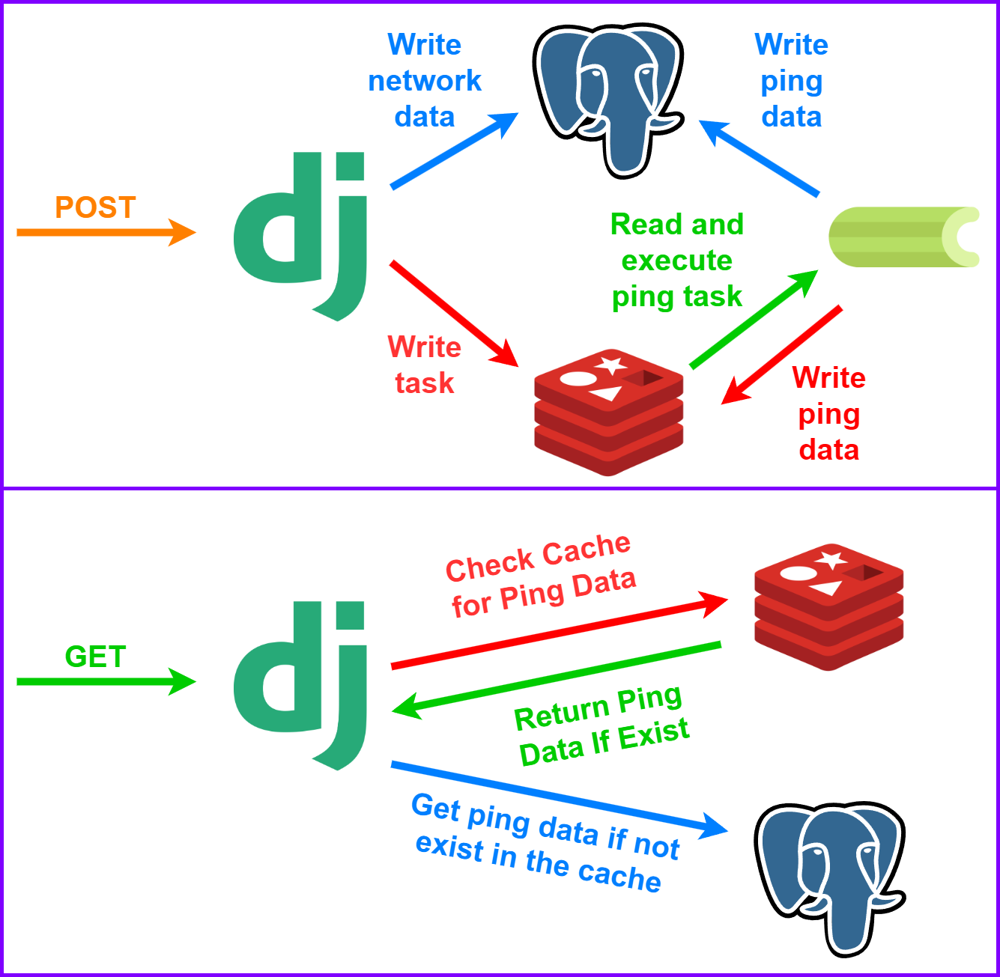

# Subnet Pinger API with Django Celery Postgres Redis Docker

### Summary:

```
This is simple API that pings subnet of given ip addresses and
returns ping results. Both Ipv4 and Ipv6 addresses are supported.

Pinging is performed asynchronously using Celery. The API
prioritizes speed and efficiency by caching recent results
and storing older ones for later retrieval.

Dockerization of the project makes it easy to deploy and manage.
Use a Postman collection for detailed request/response samples.
```



### Requirements:

```
docker
```

### Run:

```
cp config/.env.example config/.env
docker compose up --build -d
```

### Endpoints:

```http request
POST   /pinger/                    # create network
GET    /pinger/                    # list networks
GET    /pinger/{network_id}/       # list ping result
DELETE /pinger/{network_id}/       # delete network
```

### Example Requests/Responses:

#### Request:
```http request
POST /pinger/

Body:
{
    "ip_address": "192.168.1.1",
    "subnet_mask": 24
}
```

#### Response:
```json
{
    "id": 1,
    "ip_address": "192.168.1.1",
    "subnet_mask": 24,
    "status": "in queue",
    "ip_version": 4,
    "requested_at": "2023-09-29T20:28:38.458549Z"
}
```

#### Request:
```http request
GET /pinger/?page=2&page_size=2

Query:
page: int = Page number (optional) (defaul=1)
page_size: int = Items per page (optional) (defaul=50)
```

#### Response:
```json
{
    "count": 10,
    "next": "http://localhost:8000/pinger/?page=3&page_size=2",
    "previous": "http://localhost:8000/pinger/?page_size=2",
    "results": [
        {
            "id": 4,
            "ip_address": "192.168.1.1",
            "subnet_mask": 24,
            "status": "completed",
            "ip_version": 4,
            "requested_at": "2023-09-29T20:12:44.186193Z"
        },
        {
            "id": 3,
            "ip_address": "192.168.1.1",
            "subnet_mask": 24,
            "status": "in progress",
            "ip_version": 4,
            "requested_at": "2023-09-29T20:10:48.541019Z"
        }
    ]
}
```

#### Request:
```http request
GET /pinger/2/
```

#### Response:
```json
{
    "id": 2,
    "ip_address": "192.168.1.1",
    "subnet_mask": 30,
    "status": "completed",
    "ip_version": 4,
    "requested_at": "2023-09-28T20:31:57.723305Z",
    "ping_count": 2,
    "ping_list": [
        {
            "subnet_ip": "192.168.1.1",
            "status": "active",
            "checked_at": "2023-09-29T20:31:58.749132Z"
        },
        {
            "subnet_ip": "192.168.1.2",
            "status": "inactive",
            "checked_at": "2023-09-29T20:31:58.749156Z"
        }
    ]
}
```

### Database Tables:

```
Network: (id, ip_address, subnet_mask, status, ip_version, requested_at)
Ping: (id, network_id[fk], subnet_ip, status, checked_at)
```
